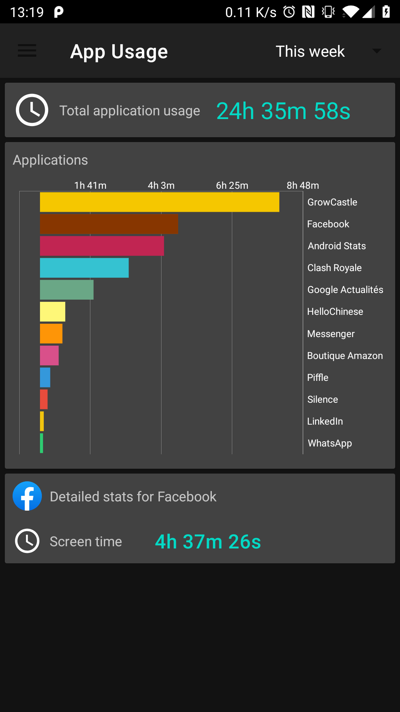
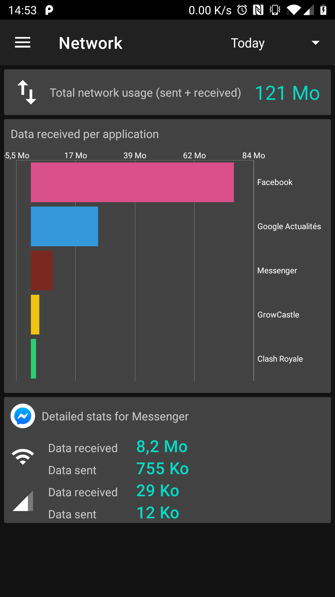

# Android-Stats - Android App

## About

Android-Stats is an Android application aimed at displaying statics such as
- Calls
- SMS / MMS
- Application screen time
- Application network usage
- Application battery usage
- ...

Users can configure a time frame for their stats, and display more details
by clicking on the displayed bars.

## Screenshots

## Permissions

Each stat view is responsible for handling required permissions.

The following ones are currently in-use:
- READ_CALL_LOG: allows to access call history
- PACKAGE_USAGE_STATS: allows to access application usage (screen time, network, ...)

## Contributing

Android-stats is a free and open source project developed by volunteers.
Any contributions are welcome.

If you wish to submit code modifications, please
- Create an issue describing your changes
- Create a merge request with your code implementation
